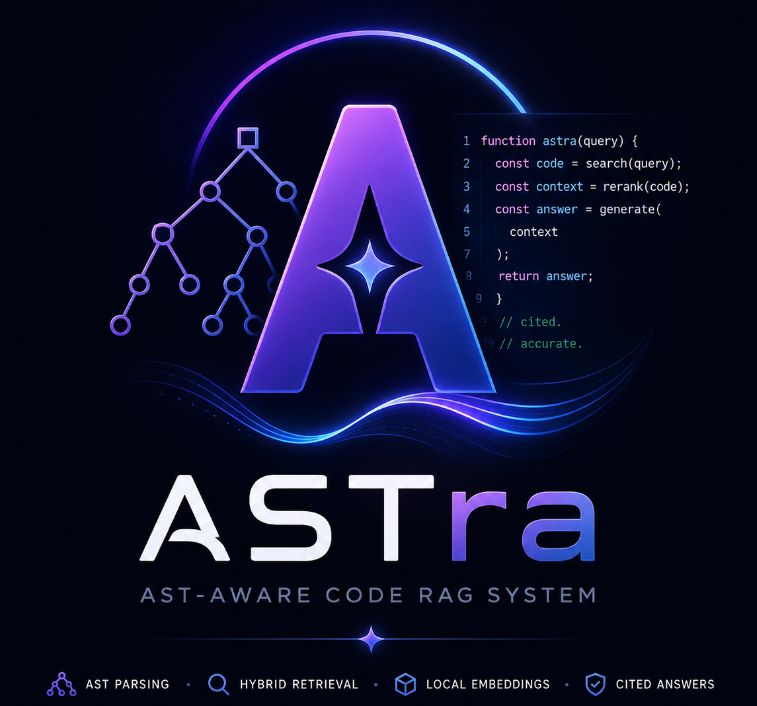

<p align="center">
  
</p>

<h1 align="center">ASTra — Ask My Codebase (AST-Aware Code RAG)</h1>

<p align="center">
  <strong>ASTra</strong> is a production-grade, local-first RAG (Retrieval-Augmented Generation) system built using Next.js (App Router), TypeScript, and web-tree-sitter. It allows users to ingest any public GitHub repository, parse its syntax trees, perform hybrid search (vector similarity + BM25 keyword matching), and obtain natural-language explanations with exact, audited <code>file:line</code> citations.
</p>

<p align="center">
  This system is fully self-contained in TypeScript, utilizing a local WebAssembly-based parser and a local ONNX-based embedding extractor to ensure zero native dependencies, zero installation friction, and zero API costs for core pipeline steps.
</p>

<p align="center">
  <a href="#architecture-overview">Architecture Overview</a> •
  <a href="#core-features">Core Features</a> •
  <a href="#complete-technology-stack">Technology Stack</a> •
  <a href="#local-setup--quick-start">Local Setup</a> •
  <a href="#verification--testing-scripts">Testing Scripts</a>
</p>

---

## Architecture Overview

```
 ┌─────────────────────────────────────────────────────────────────┐
 │                       FRONTEND (Next.js 16)                     │
 │  Repo Input Card ➔ Ingestion Dashboard ➔ Chat UI ➔ Code Drawer  │
 └───────────────────────────────┬─────────────────────────────────┘
                                 │ HTTP POST
                                 ▼
 ┌─────────────────────────────────────────────────────────────────┐
 │                     INGESTION PIPELINE (Server)                 │
 │  Git Fetcher (simple-git)  ➔  File Filter (Ignored files/size)  │
 │  AST Parser (web-tree-sitter WASM)  ➔  Doc Section Chunker     │
 │  Embeddings Engine (ONNX all-MiniLM-L6-v2) ➔ Vector DB / Local  │
 └───────────────────────────────┬─────────────────────────────────┘
                                 │ Search & Grounding
                                 ▼
 ┌─────────────────────────────────────────────────────────────────┐
 │                      RETRIEVAL & GENERATION                     │
 │  Semantic Vector Search  +  BM25 Keyword Search                 │
 │              └──► Reciprocal Rank Fusion (RRF) ◄──┘             │
 │  Confidence Threshold Guard ➔ Prompt Builder (File Inventory)   │
 │  Groq LLM Client (Llama 3.3 70B) ➔ Citation Verification Audit  │
 └─────────────────────────────────────────────────────────────────┘
```

---

## Core Features

- **AST-Aware Code Chunking**: Code files are parsed via `web-tree-sitter` WASM syntax tree extractors to carve code strictly along function, class, and method boundaries. No arbitrary token slicing.
- **Hybrid Retrieval & RRF**: Merges Semantic Vector Search (concept matching) and BM25 Lexical Keyword Search (exact syntax/symbol matches) using the Reciprocal Rank Fusion (RRF) algorithm.
- **Audited Citation Grounding**: Prevents hallucinations by mapping LLM-generated bracket citations against real source chunk ranges. Unverified claims are flagged; out-of-context queries trigger safe pre-generation refusals.
- **Multi-Hop Reference Expansion**: Detects symbols and file dependencies mentioned in initial answers and triggers a secondary retrieval pass to gather missing code contexts automatically.
- **Multi-Theme System**: Fully customizable theme selection directly in the header (Obsidian Space, Amethyst Midnight, Emerald Aurora, and Solar Flare).
- **100% JavaScript/TypeScript Stack**: Single runtime, single `package.json`, and zero native C++ compiler requirements (`node-gyp` free).

---

## Complete Technology Stack

| Layer | Dependency | Purpose |
|---|---|---|
| **Framework** | Next.js 16 (App Router), React 19, TypeScript | Server-side API endpoints, server-rendered layouts, and interactive client context states. |
| **Styling** | Tailwind CSS v4, PostCSS | Dynamic style variables, responsive layouts, glassmorphic cards, and hardware-accelerated animations. |
| **AST Parser** | `web-tree-sitter` (WASM Runtime) | Portable syntax tree parsing for JavaScript, TypeScript, and Python. |
| **Embeddings** | `@xenova/transformers` (local ONNX/WASM) | Runs `all-MiniLM-L6-v2` locally to extract 384-dimensional normalized vector embeddings. |
| **Vector Database** | ChromaDB (ChromaClient) / In-memory JSON Fallback | High-performance vector database support with immediate file-backed JSON fallback if no local container is active. |
| **Keyword Ranker** | Custom Okapi BM25 Engine | Lexical ranker featuring code-aware tokenization and symbol boosting. |
| **Repo Ingest** | `simple-git` | Programmatic git interface for shallow repository clones. |
| **LLM Inference** | `groq-sdk` (Llama 3.3 70B Versatile) | Generates natural language answers based on grounded context prompt layouts. |

---

## Key Design Decisions & Tradeoffs

### 1. Why AST-Based Chunking Over Naïve Text Splitting?
Naïve text splitters (e.g. splitting every 1000 characters) cut code mid-expression, producing snippets like `return user.id;\n}\n\nfunction calculate`. Such fragments lack semantic meaning and degrade embedding quality. AST-aware chunking parses syntax trees to extract coherent units (classes, functions, methods) so that every retrieval hit represents a single, complete logical block of code.

### 2. Why Hybrid Retrieval Over Vector Search Alone?
Pure semantic vector search is excellent at conceptual queries ("how are requests authenticated?") but often fails to locate exact code identifiers (e.g. `handleOAuth2CallbackV2`). Lexical engines like BM25 excel at exact matching. Combining them via Reciprocal Rank Fusion (RRF) ensures the retrieval engine catches both high-level concepts and exact keyword lookups.

### 3. Why Strict Citation Grounding & Pre-Generation Confidence Checks?
Generative models often hallucinate files or functions that do not exist. To enforce factuality, ASTra evaluates the maximum RRF retrieval score before calling the LLM; if the scores indicate a weak context match, it triggers an early refusal ("I couldn't find enough relevant information"). When generation is performed, the answer text is parsed and audited against the line numbers of the retrieved chunks to eliminate fabricated citations.

---

## Ingestion & Retrieval Mechanics

### Ingestion Pipeline
1. **Fetch**: Clones the public repository shallowly (`--depth 1`) using `simple-git`.
2. **Filter & Guard**: Excludes binaries, build outputs, node modules, and large files. Aborts if total repository size exceeds **50MB** to ensure a safe local demo experience.
3. **Parse & Chunk**: Routes files to tree-sitter grammars. Extracts functions, classes, and methods as chunks.
4. **Embed**: Context-enriches the text (`File: {path} | symbol: {name}\n\n{content}`) and passes it to the local ONNX model.
5. **Upsert**: Stores the vectors and metadata in ChromaDB or saves to `tmp/astra-vectors.json`.

### Hybrid Retrieval & Fusion
1. **Dual Querying**: Runs semantic similarity search and BM25 keyword matching in parallel.
2. **Reciprocal Rank Fusion**: Reranks documents based on their position in both lists using:
   $$\text{RRF Score}(d) = \sum_{m \in M} \frac{1}{60 + r_m(d)}$$
3. **Confidence Scoring**: Analyzes the top RRF score to assign a confidence index and determine if generation should proceed.

---

## Local Setup & Quick Start

### Prerequisites
- **Node.js** ≥ 20.6.0 (tested on 22.x)
- **npm** ≥ 10.x
- **Groq API Key** (Free tier key available at [console.groq.com](https://console.groq.com))

### 1. Clone & Install
```bash
git clone https://github.com/vatsalj2005/ASTra.git
cd ASTra
npm install
```

### 2. Build Tree-Sitter WASM Grammars
Compile the pre-configured grammars into WebAssembly binaries:
```bash
npm run setup:grammars
```

### 3. Setup Environment Configuration
Copy the sample environment template:
```bash
cp .env.local.example .env.local
```
Edit `.env.local` and add your Groq API key:
```env
GROQ_API_KEY=gsk_your_groq_api_key_goes_here
```

### 4. Run Development Server
```bash
npm run dev
```
Open [http://localhost:3000](http://localhost:3000) in your browser.

---

## Environment Variables Reference

| Variable Name | Required | Default Value | Description |
|---|---|---|---|
| `GROQ_API_KEY` | **Yes** | None | Your Groq Cloud API Key for LLM Q&A inference. |
| `CHROMA_URL` | No | `http://localhost:8000` | Address of your local ChromaDB container. If inactive, the app falls back to a local JSON file database. |
| `EMBEDDING_MODEL` | No | `Xenova/all-MiniLM-L6-v2` | Embedding model identifier used by `@xenova/transformers`. |

---

## Verification & Testing Scripts

ASTra contains a standalone CLI test suite to validate different components without launching the Next.js server:

- **Verify Environment & Models**:
  ```bash
  npm run verify
  ```
- **Verify Ingestion Pipeline**:
  ```bash
  npx tsx scripts/verify-ingestion.ts [repoUrl]
  ```
- **Verify Retrieval Engine & RRF Rankers**:
  ```bash
  npx tsx scripts/verify-retrieval.ts [repoUrl]
  ```
- **Verify End-to-End Generation & Audited Citations**:
  ```bash
  npx tsx scripts/verify-generation.ts [repoUrl]
  ```

---

## Project Structure

```
ASTra/
├── grammars/               # Compiled Tree-sitter WASM grammars
├── scripts/                # Standalone CLI verification suite
├── src/
│   ├── app/                # Next.js App Router Pages and API Endpoints
│   │   ├── api/            # API Endpoints (ingest, chat, health)
│   │   ├── globals.css     # Global Styles, CSS variables, and Animations
│   │   └── layout.tsx      # App wrapper layout
│   ├── components/         # Premium, Glassmorphic React Components
│   ├── context/            # Global UI and Theme Context State
│   ├── lib/                # Modular RAG Business Logic (Framework Agnostic)
│   │   ├── embeddings/     # Transformers.js embedding wrapper
│   │   ├── generation/     # Prompt constructions, Groq API, citation audits
│   │   ├── ingestion/      # Git clone, file filters, and AST chunkers
│   │   ├── parser/         # Web-tree-sitter parser initialization
│   │   ├── retrieval/      # Semantic search, BM25 ranker, and RRF fusions
│   │   └── vector-store/   # ChromaDB connections and JSON file fallbacks
│   └── types/              # Unified TypeScript definitions
```

---

## Current Scope Limitations

- **Git Auth**: Only public GitHub repositories are supported.
- **Language Scope**: AST-aware chunking is implemented for JavaScript, TypeScript, and Python. Other programming languages fallback to module-level file chunking.
- **Quantized Local Model**: The ONNX embedding model runs in single-thread WebAssembly, which can take 1–3 seconds to run embedding calculations for medium repos.

---

## Future Improvements

1. **Incremental Indexing**: Track commit hashes to only re-index files that have changed in subsequent repository updates.
2. **Additional Tree-sitter Grammars**: Incorporate WASM files for Go, Rust, Java, and C++ AST-aware parsing.
3. **Cross-Encoder Reranking**: Integrate a local cross-encoder model (e.g. `bge-reranker-base`) to rerank the top candidate chunks before feeding context to the LLM.
4. **Streaming Completions**: Adapt the API routes and frontend context to support word-by-word streaming LLM completions for improved perceived latency.
5. **Ingestion Cache**: Store extracted chunk structures in a local SQLite database to prevent redundant re-processing.

---

## License

MIT
